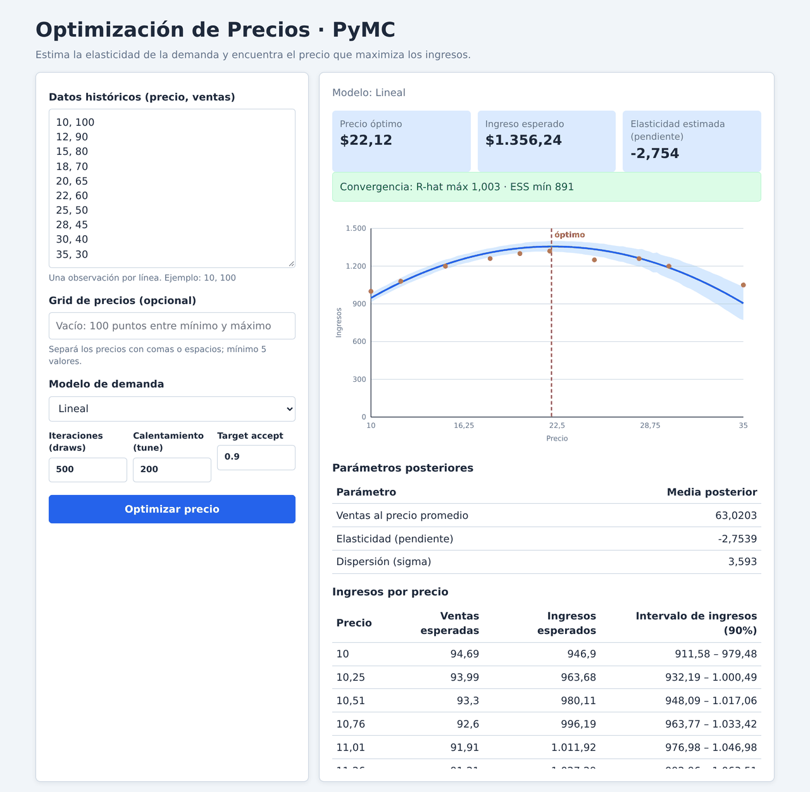

# Optimización de Precios con PyMC

Modelo bayesiano de demanda que estima la **elasticidad precio-ventas** y calcula el **precio que
maximiza los ingresos esperados**, expuesto con FastAPI y con una interfaz web propia que no necesita
compilarse.

Un solo comando levanta todo:

```bash
uv sync          # crea el entorno e instala el proyecto (trae Python 3.11 si hace falta)
uv run price-opt # levanta la API y abre http://127.0.0.1:8000
```

El navegador se abre **cuando el servidor ya está sirviendo**, no al lanzar el comando: importar PyMC
tarda unos 8 segundos, así que la pausa entre el comando y la página es normal. Con `--no-open` no
abre el navegador (útil para dejarlo en segundo plano) y con `--port` / `--host` cambiás dónde
escucha.

Con los diez datos de ejemplo que trae el formulario, una corrida real devuelve:

```
Precio óptimo:            22.12
Ingreso esperado:       1355.71
Intervalo HDI 90%:   1312.14 – 1398.96
Elasticidad (pendiente): -2.756
Convergencia:              sí (R-hat máx 1.002, ESS mín 3510)
Tiempo de inferencia:    ~21 s en 4 núcleos (draws=2000, tune=1000)
```

El muestreo es estocástico: los números cambian entre corridas. Lo que importa es el orden de
magnitud, que el óptimo caiga dentro del rango analizado y que la convergencia sea confiable.

---

## 1. La interfaz web

Una sola página, `price_optimizer/static/`, sin framework, sin bundler y sin pedidos a ningún host
externo. El gráfico se dibuja en el navegador como SVG a partir del JSON de la API.



*Captura real de la app con las diez filas de ejemplo, `draws=500` y `tune=200`. Los valores cambian
entre corridas porque el muestreo es estocástico.*

La página:

- **Valida antes de enviar**, con los mismos límites que el backend, así que un dato fuera de rango da
  un mensaje claro en el formulario en vez de un `422` crudo de la API.
- Muestra los KPI (precio óptimo, ingreso esperado y, en el modelo lineal, la pendiente estimada).
- Dibuja la curva de ingresos esperados, su banda HDI 90%, los puntos observados y una línea punteada en el óptimo.
- Devuelve la tabla de parámetros posteriores y la tabla precio / ventas / ingresos, con su intervalo HDI 90%, de todo el grid.
- No hace ninguna petición a un CDN: se puede mostrar sin internet.

## 2. API HTTP

| Método | Ruta        | Devuelve                                                   |
|--------|-------------|------------------------------------------------------------|
| GET    | `/`         | La interfaz web (`index.html`)                              |
| GET    | `/health`   | Estado JSON: `status`, `version`, `timestamp`               |
| POST   | `/optimise` | Corrida completa de inferencia y precio óptimo              |
| GET    | `/docs`     | Documentación interactiva autogenerada por FastAPI (Swagger) |

### 2.1 Ejemplo con curl

```bash
curl -X POST http://127.0.0.1:8000/optimise \
  -H "Content-Type: application/json" \
  -d '{
    "observations": [
      {"precio": 10, "ventas": 100},
      {"precio": 15, "ventas": 80},
      {"precio": 20, "ventas": 65},
      {"precio": 25, "ventas": 50},
      {"precio": 30, "ventas": 40}
    ],
    "draws": 500,
    "tune": 200
  }'
```

### 2.2 Respuesta

Salida real de una corrida del ejemplo de diez filas (arrays truncados a tres valores de los 100 del grid):

```json
{
  "price_grid": [10.0, 10.252525252525253, 10.505050505050505, "… 100 puntos …"],
  "expected_sales": [94.69260160800098, 93.99661750551593, 93.3006334030304, "…"],
  "expected_sales_hdi_low": [91.18182249474964, 90.54063615378145, 89.89389109222223, "…"],
  "expected_sales_hdi_high": [98.23378951988227, 97.4854147509556, 96.7344632935181, "…"],
  "expected_revenue": [946.9260160800053, 963.7026946272523, 980.1278660520375, "…"],
  "expected_revenue_hdi_low": [911.8182249474964, 928.2701585463452, 944.3398660193043, "…"],
  "expected_revenue_hdi_high": [982.3378951988227, 999.47167648707, 1016.2004224773619, "…"],
  "optimal_price": 22.12121212121212,
  "optimal_expected_revenue": 1355.7065522045827,
  "parameter_means": {"intercepto": 62.99748558081465, "pendiente": -2.756097045842298, "sigma_ventas": 3.6523089872207137},
  "diagnostics": {"max_rhat": 1.0020976510244064, "min_ess": 3509.901517339148, "converged": true, "rhat": {"intercepto": 1.0021, "pendiente": 1.0013, "sigma_ventas": 1.0010}, "ess": {"intercepto": 4541.59, "pendiente": 6189.86, "sigma_ventas": 3509.90}},
  "warnings": [],
  "model_type": "linear",
  "degree": 2
}
```

Esa corrida tardó ~18 s en 4 núcleos. Como el muestreo es estocástico, los valores cambian entre
corridas: el `optimal_price` que veas puede diferir en algunos centavos.

Cuando no se envía `price_grid`, el modelo genera un grid uniforme de **100 puntos entre el precio
mínimo y el máximo observados**. El precio óptimo siempre es uno de los puntos de ese grid.

### 2.3 Validaciones del request

| Campo           | Tipo         | Default    | Rango válido                          |
|-----------------|--------------|------------|---------------------------------------|
| `observations`  | `list`       | —          | ≥ 3 observaciones, `precio` > 0, `ventas` ≥ 0 |
| `price_grid`    | `list\|null` | null       | ≥ 5 valores, finitos y positivos       |
| `draws`         | `int`        | 2000       | [500, 10000]                          |
| `tune`          | `int`        | 1000       | [200, 10000]                          |
| `target_accept` | `float`      | 0.9        | [0.5, 0.99]                           |
| `model_type`    | `str`        | `"linear"` | `"linear"` o `"polynomial"`           |
| `degree`        | `int`        | 2          | [1, 5] y estrictamente menor que la cantidad de observaciones |

Ningún valor `NaN` ni infinito es aceptado: Pydantic los rechaza antes de llegar al modelo.

### 2.4 Errores

| Código | Cuándo                                                        | Cuerpo                                        |
|--------|---------------------------------------------------------------|-----------------------------------------------|
| `422`  | El request no pasa la validación                                    | `detail` = lista de errores. Las reglas propias del proyecto responden en español (`"Debe proporcionar al menos 3 observaciones..."`); los límites de rango y tipo los genera Pydantic en inglés (`"Input should be greater than or equal to 500"`) |
| `400`  | El modelo rechazó los datos (guardas del helper)               | `detail` = string                             |
| `504`  | La inferencia superó `INFERENCE_TIMEOUT_SECONDS` (120 s)       | `detail` = `"Inference timed out"`            |

El timeout es una constante de módulo en `price_optimizer/api.py`; para cambiarlo, editá
`INFERENCE_TIMEOUT_SECONDS`.

## 3. El modelo estadístico

Regresión bayesiana de `ventas` contra `precio`, con dos formas funcionales:

- **Lineal** (default): `ventas ~ Normal(intercepto + pendiente · (precio - precio_promedio), sigma_ventas)`. La pendiente
  es la elasticidad y es constante en todo el rango.
- **Polinómico**: `ventas ~ Normal(intercepto + Σ beta_k · (precio - precio_promedio)^k, sigma_ventas)` para capturar
  curvatura. El grado se valida contra la cantidad de observaciones para evitar sobreajuste.

| Parámetro       | Prior                                                                 |
|-----------------|-----------------------------------------------------------------------|
| `intercepto`    | Normal centrada en la media de ventas y escalada a los datos |
| `pendiente`     | Normal débilmente informativa centrada en 0                 |
| `beta_k`        | Normal débilmente informativa centrada en 0 (solo polinómico) |
| `sigma_ventas`  | HalfNormal escalada a la dispersión de ventas                |

Se infiere con NUTS usando **cuatro cadenas** (`pm.sample`), se promedia la posterior sobre el grid de
precios y se toma el `argmax` de `precio · ventas_esperadas`.

### 3.1 Límites que conocemos

- Los umbrales de convergencia son convenciones elegidas: R-hat máximo `1.01` y ESS mínimo `100`.
- El intervalo mostrado es un HDI del 90%, no una garantía frecuentista de cobertura.
- Las ventas esperadas negativas se recortan a cero antes de calcular ingresos.
- `intercepto` significa ventas esperadas al precio promedio observado.
- El muestreo usa cuatro cadenas, por lo que cada request cuesta aproximadamente el doble de CPU que
  el default anterior de dos cadenas.

## 4. Tests

```bash
uv run pytest -q                    # 51 tests rápidos: no corren el sampler real
uv run pytest -q -m integration     # el sampler real de PyMC de punta a punta
uv run ruff check .                 # lint (line-length 120)
node --check price_optimizer/static/app.js   # sintaxis del JS (opcional, requiere node)
```

| Archivo                    | Qué cubre                                                                                                 |
|----------------------------|-----------------------------------------------------------------------------------------------------------|
| `tests/test_model.py`      | Coerción de datos, construcción y límites del grid, estructura del resultado, modelo polinómico, guardas de `degree` y `model_type`. Un test marcado `integration` corre el sampler real. |
| `tests/test_api.py`        | Contrato de `/health` y `/optimise`, que los parámetros del request se reenvíen al modelo, y cada validación (422), el `ValueError` del helper (400) y el timeout (504). |
| `tests/test_static_ui.py`  | Que `/` sirva el HTML, que los assets respondan, que cada `id` que busca el JS exista en el HTML y que no haya pedidos a hosts externos. |
| `tests/test_cli.py`        | Que el navegador se abra solo cuando el servidor ya está sirviendo (importar PyMC tarda ~8 s).            |

Cobertura honesta: **no hay tests unitarios del JavaScript**. La lógica pura de `app.js` se verifica de
forma estructural (referencias cruzadas de `id`, assets servidos, sintaxis) y su comportamiento en el
navegador se prueba a mano. La suite deja 2 warnings de deprecación que vienen de `starlette.testclient`
y `anyio`, no del proyecto.

Esos mismos comandos los corre **GitHub Actions** en cada push a `main` y en cada pull request
(`.github/workflows/ci.yml`), más dos pasos previos: `uv sync --locked`, para que un `uv.lock`
desactualizado falle en lugar de resolver otra cosa, y un guard que verifica que cada leg de la matriz
—Python 3.11 y 3.12, el rango que declara `pyproject.toml`— realmente probó la versión que dice. Las
acciones están fijadas a la major vigente cuando son de primera parte (`actions/checkout@v7`) y a un
tag inmutable cuando son de terceros (`astral-sh/setup-uv@v10.0.1`).

## 5. Estructura del proyecto

```
price_optimizer/
  model.py        Modelo PyMC reutilizable (sin FastAPI, sin matplotlib)
  api.py          FastAPI: sirve la UI, /health, /optimise
  cli.py          Entry point `price-opt` (uvicorn + abrir el navegador)
  static/
    index.html    Formulario y panel de resultados
    styles.css    Estilos propios, sin dependencias
    app.js        Validación en el cliente, llamada a la API, gráfico SVG
tests/
  test_model.py   Tests del modelo
  test_api.py     Tests del contrato HTTP
  test_static_ui.py  Tests de los assets de la UI
docs/screenshot.png   Captura real de la interfaz, usada en el README
.github/workflows/ci.yml  CI: matriz de Python, lint, tests y sampler real
odd/tasks/        Plan de trabajo de la migración (ODD)
pyproject.toml    Dependencias, entry point y configuración de pytest y ruff
uv.lock           Versiones exactas resueltas (se versiona)
```

Versiones que resuelve `uv.lock` hoy: PyMC 5.28.5, NumPy 2.4.6, pandas 3.0.5, FastAPI 0.141.1,
Uvicorn 0.53.0, Pydantic 2.13.5. Requiere Python `>=3.11,<3.13` (uv instala 3.11 si no está).

## 6. Decisiones de diseño

- **Decisión**: interfaz web servida por el propio backend, en vez de una app Flutter.
  - **Razón**: un solo proceso y un solo comando para correr, mostrar y probar el proyecto; sin
    toolchain de frontend, sin build step y sin `.env` que configurar.
  - **Consecuencia**: la UI se escribe a mano en HTML/CSS/JS y su lógica no tiene tests unitarios.

- **Decisión**: paquete instalable `price_optimizer/` con entry point `price-opt`.
  - **Razón**: elimina el `sys.path.insert` del backend anterior y el módulo con mayúsculas en la raíz;
    permite `uv run price-opt` y `uv run pytest` sin configurar `PYTHONPATH`.
  - **Consecuencia**: hay que instalarlo (`uv sync`) para correrlo.

- **Decisión**: sin `matplotlib` y sin PNG en base64 en la respuesta.
  - **Razón**: menos dependencias nuestras y un gráfico que el navegador redibuja y escala sin costo.
  - **Consecuencia**: `matplotlib` sigue apareciendo en el entorno porque lo trae PyMC como dependencia
    transitiva, pero el proyecto ya no lo usa.

- **Decisión**: sin CORS, porque la UI y la API viven en el mismo origen.
  - **Razón**: menos configuración y menos superficie expuesta.
  - **Consecuencia**: consumir la API desde otro dominio requiere volver a agregar el middleware.

- **Decisión**: trabajar con `InferenceData` en vez de `return_inferencedata=False`.
  - **Razón**: el flag está deprecado y rompe en la próxima major de PyMC.
  - **Consecuencia**: `raw_trace` se aplana a listas de Python.

- **Decisión**: la configuración de pytest y ruff vive en `pyproject.toml`.
  - **Razón**: una sola fuente de configuración para el proyecto.
  - **Consecuencia**: `pytest.ini` y `backend/requirements.txt` desaparecieron; las versiones vienen de
    `uv.lock`.

## 7. Riesgos conocidos

- **Sin autenticación, sin rate limiting y sin cola de trabajos.** Cualquiera que alcance el puerto
  puede disparar inferencias que saturan el CPU. Está pensado para correr local. El siguiente cuello de
  botella real es la concurrencia: cada request compila y muestrea sin queue.
- **Sin Dockerfile.** El CI corre en cada push, pero no hay imagen de contenedor ni despliegue
  reproducible fuera de `uv`.
- **Los diagnósticos de convergencia son convenciones.** R-hat máximo 1.01 y ESS mínimo 100 son
  umbrales prácticos, no una garantía de inferencia correcta.
- **El óptimo puede caer en el borde del grid.** La API lo advierte; ver §3.1.
- **Sin persistencia.** El servicio es stateless: no guarda historial de optimizaciones.
- **El timeout no cancela el sampler.** A los 120 s `asyncio.wait_for` devuelve 504, pero el hilo que
  está muestreando sigue ocupando CPU hasta terminar (`asyncio.to_thread` no es cancelable). Un cliente
  que reintente después de un 504 puede apilar inferencias sobre el mismo CPU.
- **Sin `Content-Security-Policy`.** El HTML se construye con datos de la propia API (números y nombres
  de parámetros controlados por el servidor), pero no hay CSP explícita.

## 8. Troubleshooting

- **El puerto está ocupado**: `uv run price-opt --port 9000`. Con `--no-open` no abre el navegador (útil
  para levantar el servidor en segundo plano).
- **El comando parece colgado al arrancar**: no lo está. `import pymc` tarda ~8 s y el navegador recién
  se abre cuando uvicorn terminó de levantar; en la terminal aparecen "Importando PyMC…" y después
  "Uvicorn running on …".
- **Desarrollo con recarga automática**: `uv run uvicorn price_optimizer.api:app --reload`.
- **La inferencia tarda demasiado**: bajá `draws` a 500 y `tune` a 200 durante el desarrollo. Para
  producción real conviene `draws=2000`, `tune=1000`, `target_accept=0.9`.
- **Aparecen avisos de convergencia en el log**: subí `draws`/`tune` o `target_accept`. Con menos de
  ~500 iteraciones por cadena las advertencias de R-hat son esperables.
- **Entorno roto**: `uv sync` lo reconstruye desde `uv.lock`. Para verificar que no quedó nada viejo,
  `uv run pytest -q`.
- **Necesitás Python 3.12 en lugar de 3.11**: cambiá `.python-version` y `requires-python`.

## 9. Material de contexto

- `RECOMENDACIONES.md`: mejoras pendientes, priorizadas por impacto y esfuerzo.
- `Aplicaciones_Financieras_PyMC.md`: notas generales sobre PyMC aplicado a finanzas (material de
  estudio, no forma parte de este código).
- `odd/tasks/web-ui-replacement.md`: el plan y las decisiones de la migración de Flutter a la UI web.
